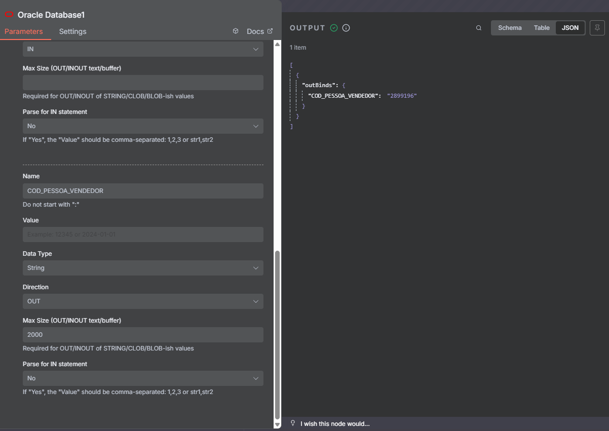

# n8n-nodes-oracle-database-bind

[Oracle](https://docs.oracle.com/en/database/oracle/oracle-database/) database node for n8n

Forked from https://www.npmjs.com/package/n8n-nodes-oracle-database-parameterization with the intent of adding bind variables type IN, OUT and INOUT.

## Normal Query Example

### New Functionality (bind variable OUT)

### Functionality from fork (parameters)

Example query:

Example Query Using IN operator:

## License

[MIT](https://github.com/matheuspeluchi/n8n-nodes-oracle-database/blob/main/LICENSE.md)
